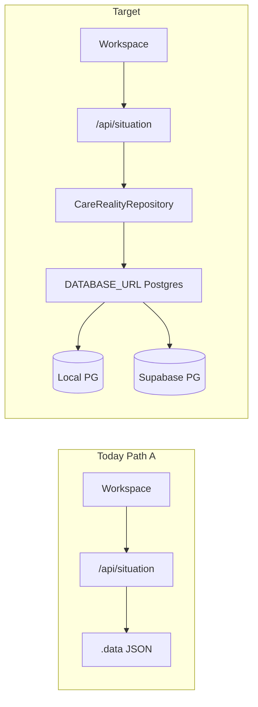

# Care Reality Engine → Postgres / Supabase

**Status:** Proposal only — do not rewrite the working `.data/` path until approved  
**Inspected:** 2026-07-22

## Critical security first

You pasted **live Supabase keys and JWTs in chat**. Treat them as compromised:

1. **Rotate** secret / publishable / anon keys in the Supabase dashboard before production use.
2. Store replacements **only** in `.env.local` (gitignored) — never commit, never put secrets in `NEXT_PUBLIC_*`.
3. You did **not** provide a Postgres `DATABASE_URL` (host/password). Supabase API keys alone are not enough for the SQL Care Reality spine. Need Supabase **Database → Connection string** (URI), plus a local `DATABASE_URL` for dev.

Proposed env names (after rotation):

```bash
# Postgres (local OR Supabase — same schema)
DATABASE_URL=

# Supabase (server)
SUPABASE_URL=https://<project-ref>.supabase.co
SUPABASE_ANON_KEY=
SUPABASE_PUBLISHABLE_KEY=
SUPABASE_SECRET_KEY=   # SERVER ONLY — never NEXT_PUBLIC
```

---

## Current state (inspection)

| Layer | Today |
|--------|--------|
| Care Reality SoT | `.data/` JSON via `src/lib/living-care-record-persistence/fs-store.ts` |
| Postgres | Optional `DATABASE_URL` + `pg` for telemetry/ops — **not** LCR spine |
| Auth | Anonymous durable care key; optional in-memory identity |
| Supabase | **Not integrated** |
| Migrations | Partial (`care_recipients`, `caregivers`, `care_events`, `observations`) — not MVP SoT |

Product rule preserved: documents = inputs into Care Reality; no document manager / chatbot / task app.



---

## Migration plan (incremental)

### Phase 0 — Env + abstraction (no behavior change)

- Extend `.env.local.example` with Supabase vars + `DATABASE_URL` docs.
- Write rotated keys into `.env.local` only.
- Thin `src/lib/db/`: `getPool()` from `DATABASE_URL` (reuse existing `createPostgresPool` pattern).

### Phase 1 — Schema aligned to Care Reality SoT

New migration e.g. `db/migrations/XXX_care_reality_spine.sql` — same file for local + Supabase:

| Table | Purpose |
|-------|---------|
| `care_recipients` | Person receiving care (+ `external_care_key` for today’s `care_*` keys) |
| `contributors` | Who adds evidence (`id`, `name`, `role`) |
| `care_events` | Timeline occurrences |
| `observations` | Witnessed state |
| `decisions` | Decision memory: decision, reason, evidence, participants, date, outcome, status |
| `care_relationships` | from_entity / to_entity / relationship_type |
| `uncertainties` | Open questions |

Reuse existing migrations where shapes match; add missing tables/columns rather than duplicate.

### Phase 2 — Repository interface (dual-write)

`CareRealityRepository`: load / append event·observation·decision / link / uncertainty / timeline.

- Default: keep `.data/` FS.
- When `DATABASE_URL` set: dual-write; flag `CARE_REALITY_STORE=fs|postgres|dual`.
- Keep `/api/situation` as the single entry — swap store behind it.

### Phase 3 — Continuity + attribution

Same care recipient + events + open uncertainties + decisions on return. One Care Reality; attribute `created_by`.

### Phase 4 — Document ingestion foundation

Documents → events / observations / decisions / unknowns. Storage later. No document vault UI.

### Phase 5 — Frontend

Wire timeline reads to repository. Keep anonymous care key for MVP. Supabase Auth optional later.

---

## Non-goals

- Chatbot / reminders-first / dashboards / medical advice engine.
- Rewriting Gemini / composer.
- Committing secrets or exposing service role to the browser.
- Git push / launch without explicit permission.

---

## First execution steps (after approve + DATABASE_URL)

1. Rotate keys; provide `DATABASE_URL`.
2. Write `.env.local` + update example placeholders.
3. Add spine SQL + `src/lib/db` + repository (FS adapter unchanged).
4. Dual-write one path; prove continuity.
5. Switch read path to Postgres only when green.

**Verification:** same migration on local + Supabase; `verify:product-path` stays green; add `verify:care-reality-db`.
