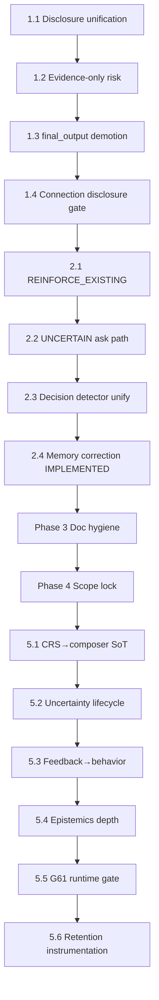

# Spine build sequence — Phases 1–5

**Status:** Canonical build order (Product Steward + Engineering Charter)  
**Purpose:** Ship **complete slices** in sequence — never half-baked parallel work.  
**Authority:** [`product-truth-path.md`](./product-truth-path.md) · Golden scenarios gate · Response intelligence upgrade  
**Target maturity:** Phase 1–2 → **~90** spine trustworthy · Phase 5 → **~93–95** compounding learning  

---

## Build laws (non-negotiable)

1. **One slice = one PR = green verifies** before the next slice starts.  
2. **Engine spine before UI chrome** — CareContext → SRE → CRS → composer → panel.  
3. **No prompt patches** — behavior changes need engine/gate + verify script.  
4. **Composer path only** — never make `final_output` caregiver-visible to “fix” a gap.  
5. **Docs + `architecture-map.ts` in the same PR** when behavior or architecture changes.  
6. **Defer explicitly** — if a slice touches FUTURE scope (graph UI, Care Moment, pipeline rewrite), stop and mark STUB.

**Exit gate per slice:** relevant `npm run verify:*` green + no new acceptance-gate throws on golden fixtures.

---

## Dependency overview



---

## Phase 1 — Lock product truth (~88–92% behavior/response)

**Goal:** Single caregiver authority; relief tree owns disclosure; no internal compile leaking.  
**Do not start Phase 2 until all four slices merge.**

### Slice 1.1 — Disclosure unification (relief tree wins) — **IMPLEMENTED**

| | |
|--|--|
| **Problem** | CRS `buildDisclosurePlan` and `decideReliefDisclosure` can disagree on Clarity. |
| **Change** | Derive `disclosure_plan.show_what_matters_now`, `show_questions`, `max_questions` from relief decision at `buildLivingCareRecordResponse` (and optionally at ingest when plan is built). |
| **Modules** | `response-contract/relief-decision.ts`, `response-contract/disclosure-merge.ts`, `response-behavior/index.ts` (`resolveReliefDecisionForTurn`), `living-care-record-ux/build-response.ts`, `active-care-situation/ingest.ts` (`applyReliefFieldsToDisclosurePlan`), `care-reality-state/disclosure.ts` (CRS stage plan only) |
| **Verify** | `verify:relief-reasoning`, `verify:care-reality-state`, `verify:living-care-record-ux` — all green |
| **Done when** | Soft-only never shows Clarity; orientable care always can; no dual-authority test failures |

### Slice 1.2 — Evidence-only risk (remove kind shortcut) — **IMPLEMENTED**

| | |
|--|--|
| **Problem** | `kind === "fall"` bumps risk without held evidence. |
| **Change** | Risk from held signals, `what_may_become_serious`, epistemic severity — never event kind alone. |
| **Modules** | `caregiver-response-composer/index.ts`, `response-intelligence/attention-label.ts`, `care-epistemics` (severity if needed) |
| **Verify** | `verify:response-contract`, `verify:caregiver-response-composer`, extend relief-reasoning if needed |
| **Done when** | Fall mention without immediacy ≠ automatic medium attention |

### Slice 1.3 — Demote `final_output` on caregiver surfaces — **IMPLEMENTED**

| | |
|--|--|
| **Problem** | Two truths; API may expose compiled output caregivers never see in panel. |
| **Change** | Strip `final_output` from caregiver DTO; document INTERNAL in `caregiver-response-dto.ts`; panel uses composer/LCR only. |
| **Modules** | `situation-entry/caregiver-response-dto.ts`, `SituationResponsePanel.tsx`, `app/api/situation/route.ts` (reentry path), `product-truth-path.md` |
| **Verify** | `verify:living-care-record-regression`, `verify:single-user-journey` — all green |
| **Done when** | Caregiver workspace has one response source; ops/analyze paths unchanged |

### Slice 1.4 — Panel connection disclosure integrity — **IMPLEMENTED**

| | |
|--|--|
| **Problem** | `connection_note` renders when `observation_count > 1` regardless of plan. |
| **Change** | Composer sets `show_connection`; `mergeReliefIntoDisclosurePlan` + LCR view + panel gate on plan flag. |
| **Modules** | `LivingCareRecordPanel.tsx`, `build-response.ts`, `caregiver-response-composer/index.ts`, `response-contract/disclosure-merge.ts` |
| **Verify** | `verify:care-memory-maturity`, `verify:response-intelligence-upgrade` — all green |
| **Done when** | New users never see connection; returning users do when composer sets it |

**Phase 1 exit criteria:** Meta-only + soft gather + orientable care scenarios pass; product-truth path fully enforced; ~**90% response/behavior** on golden subset G1, G5, G7, G10, meta fixtures. **Phase 1 slices 1.1–1.4 complete.**

---

## Phase 2 — Decision spine (~85–90% decision)

**Goal:** SRE decisions behave as documented; Decision Memory linked; no silent dupes.  
**Phase 3 doc hygiene may proceed; Slice 2.4 (memory correction wire) is IMPLEMENTED.**

### Slice 2.1 — `REINFORCE_EXISTING` short-circuit — **IMPLEMENTED**

| | |
|--|--|
| **Problem** | SRE returns reinforce; ingest still appends near-duplicate observations. |
| **Change** | When `relationship_decision === "REINFORCE_EXISTING"`, skip append or merge as reinforcement signal on ACS/CRS — not new timeline row. |
| **Modules** | `active-care-situation/ingest.ts`, `situation-relationship-engine/evaluate.ts`, `spine-link.ts` |
| **Verify** | `verify:situation-relationship-engine` (G15), new reinforce ingest test |
| **Done when** | Restated concern does not inflate observation count or fake “new” care story |

### Slice 2.2 — `UNCERTAIN_NEEDS_REVIEW` → one soft ask — **IMPLEMENTED**

| | |
|--|--|
| **Problem** | Identity mismatch opens new silently; directive promises rare ask. |
| **Change** | Composer path: when SRE stamps `identity_mismatch`, one clarification ask (not interview); no fake continuity. |
| **Modules** | `situation-relationship-engine`, `caregiver-response-composer`, `response-acceptance-gate` |
| **Verify** | Extend `verify:situation-relationship-engine`, `verify:caregiver-response-composer` |
| **Done when** | Mismatch turn gets ≤1 ask; no “Added to care story” without care-worthy evidence |

### Slice 2.3 — Unify decision detectors — **IMPLEMENTED**

| | |
|--|--|
| **Problem** | `looksLikeCareDecision` (SRE) vs `looksLikeDecisionEvidence` (Decision Memory) diverge. |
| **Change** | Single epistemic decision signal; `recordDecisionFromText` when SRE says `ADD_RELATED_EVENT` or unified detector fires; document split if intentional. |
| **Modules** | `decision-memory/index.ts`, `situation-relationship-engine/signals.ts`, `ingest.ts` |
| **Verify** | `verify:continuity-core-tier1` (G13), `verify:decision-memory` if present |
| **Done when** | Decision in note → Decision Memory + composer surfaces why-path when held |

### Slice 2.4 — Memory correction (Phase 12) — minimal wire — **IMPLEMENTED**

| | |
|--|--|
| **Problem** | `recordMemoryCorrection` existed; zero ingest call sites. |
| **Change** | Principle-based explicit-correction detection → `ingestMemoryCorrection` early in ACS ingest → CRS `memory_correction` (belief update + prior kept as disputed evidence). Same path for text/document kinds (Input Entry Contract). No scenario noun templates. |
| **Modules** | `care-reality-engine/detect-memory-correction.ts`, `memory-correction.ts`, `care-reality-state/process.ts`, `active-care-situation/ingest.ts` |
| **Verify** | `verify:memory-correction` |
| **Done when** | Explicit correction (e.g. “That’s wrong — she didn’t fall”) updates belief + keeps prior as conflict evidence |

**Phase 2 exit criteria:** SRE golden set G14–G17 + G13 + reinforce + uncertain pass; ~**88–90% decision** integrity.

---

## Phase 3 — Doc hygiene (~90 stable) — **IMPLEMENTED**

**Goal:** Stop drift; honest IMPLEMENTED / FUTURE / INTERNAL labels. **No runtime uplift expected.**

### Slice 3.1 — Status markers sweep — **IMPLEMENTED**

| | |
|--|--|
| **Deliverable** | [`module-status.md`](./module-status.md) — all major spine + v1.4 + PRD modules marked IMPLEMENTED · IN-MEMORY · STUB · SCHEMA-ONLY · FUTURE · INTERNAL; canonical docs + PRDs cross-linked |
| **Verify** | Doc review; no new runtime verify required |

### Slice 3.2 — Conflict ADRs — **IMPLEMENTED**

| ADR topic | ADR | Resolves |
|-----------|-----|----------|
| Emotional phrasing | [ADR-023](../15-architecture-decisions/ADR-023-emotional-phrasing-record-voice.md) | “That sounds difficult” etc. → **ban** in composer; **prefer** record voice (“You mentioned…”) |
| Epistemic labels | [ADR-024](../15-architecture-decisions/ADR-024-epistemic-labels-internal-vs-lcr.md) | Internal Known/Likely/Unknown vs caregiver **Changed / Still unclear** |
| G61 placement | [ADR-025](../15-architecture-decisions/ADR-025-g61-verify-only-not-compose-gate.md) | CI primary + optional compose-path gate (dev throw / prod log); never blocks capture |

### Slice 3.3 — Golden scenario map — **IMPLEMENTED**

| | |
|--|--|
| **Deliverable** | [`golden-scenario-map.md`](./golden-scenario-map.md) — **single master table**: G1–G19 + dementia-critical + dementia-extended + G61 → verify script → composer yes/no/partial/verify-only → Path A runtime |
| **Verify** | Phase 4 Slice 4.2 may add CI meta-verify against this table |

### Slice 3.4 — Promote decision-continuity doc — **IMPLEMENTED**

| | |
|--|--|
| **Deliverable** | [`docs/02-product/solenos-decision-continuity.md`](../02-product/solenos-decision-continuity.md) — full product SoT (pipeline, fields, verify, honest status) |
| **Cursor rule** | [`.cursor/rules/solenos-decision-continuity.mdc`](../../.cursor/rules/solenos-decision-continuity.mdc) — pointer only |

**Phase 3 exit criteria:** Zero known doc/code conflicts without ADR; onboarding dev can read [product-truth-path](./product-truth-path.md) + [solenos-decision-continuity.md](../02-product/solenos-decision-continuity.md) only. Deeper reference: [module-status](./module-status.md) · [golden-scenario-map](./golden-scenario-map.md).

---

## Phase 4 — Scope lock (hold ~90) — **IMPLEMENTED**

**Goal:** Prevent regression while Phase 5 builds. **Explicit defer list enforced in PR review.**

| Block until Phase 5 complete | Reason |
|------------------------------|--------|
| Situation Graph UI | No graph infra in MVP |
| Full `pipeline.ts` reorder | Product truth path already chose composer |
| Care Moment / I Need Clarity UI | Future capabilities ADR |
| PostgreSQL graph tables | SCHEMA-ONLY |
| Runtime North Star block on every feature | Telemetry-first; ADR if enforced |
| v1.4 analyze as primary caregiver path | MVP = `/api/situation` |

**SoT:** [`scope-lock.md`](./scope-lock.md) · **Module:** `src/lib/phase-scope-lock`

### Slice 4.1 — Scope lock gates — **IMPLEMENTED**

| | |
|--|--|
| **Deliverable** | `assertFutureCapabilityNotMvp()` on deferred surface paths (`deferred-surfaces.ts`) + `assertPhaseScopeLockNotMvp()` + `verify:scope-lock` scans `src/components/mvp-workspace/`, pipeline, composer, LCR UX |
| **PR rule** | Touching a deferred path → run `npm run verify:scope-lock` (calls `assertDeferredSurfaceFile` per file) |
| **Verify** | `npm run verify:scope-lock` |

### Slice 4.2 — Golden map meta-verify — **IMPLEMENTED**

| | |
|--|--|
| **Deliverable** | `src/lib/golden-scenario-map` + `verify:golden-scenario-map` — exact G1–G19 + dementia + G61 set; master row parse (verify + composer + runtime); script files on disk |
| **CI bundle** | `npm run verify:phase4-scope-lock` (= scope-lock + golden-map + future-capabilities) |
| **Verify** | `npm run verify:golden-scenario-map` |

**Phase 4 exit criteria:** `verify:scope-lock` + `verify:golden-scenario-map` + `verify:future-capabilities` green; defer list in PR review.

---

## Phase 5 — Compounding learning loop (~93–95) — **IN PROGRESS** (5.1 done)

**Goal:** Every input improves **next** understanding via durable state — not model retraining.  
**Slice 5.1:** CRS → composer SoT — **IMPLEMENTED** (`verify:crs-composer-sot`).

**Entry gate today:**

| Prerequisite | Status |
|--------------|--------|
| Phase 1 | **IMPLEMENTED** |
| Phase 2 slices 2.1–2.3 | **IMPLEMENTED** |
| Phase 2 slice 2.4 | **IMPLEMENTED** |
| Phase 3 golden map | **IMPLEMENTED** |
| Phase 4 scope lock | **IMPLEMENTED** |

```bash
npm run verify:phase5-entry-gate
```

**SoT:** [`phase-5-compounding-loop.md`](./phase-5-compounding-loop.md)

### Slice 5.1 — CRS → composer as SoT (reasoning depth) — **IMPLEMENTED**

| | |
|--|--|
| **Problem** | Composer sometimes re-derives from latest message; CRS bypassed. |
| **Change** | Compose reads `current_understanding`, `open_uncertainties`, `understanding_revisions`, `supporting_evidence` from CRS first; latest message is delta only. |
| **Modules** | `caregiver-response-composer/crs-compose-sot.ts`, `care-reality-state`, `getCareRealityState` |
| **Verify** | `verify:crs-composer-sot`, `verify:return-continuity` (G10–G11) |
| **Done when** | Second turn orientation references CRS held facts without re-ingesting meta |

### Slice 5.2 — Uncertainty lifecycle (learning = questions close) — **IMPLEMENTED**

| | |
|--|--|
| **Problem** | Open uncertainties persist but answer→close path incomplete. |
| **Change** | `answers_uncertainty` + `reconcileOpenUncertainties` closes CRS gap; unanswered → one soft return invite. |
| **Modules** | `progressive-understanding/uncertainty-lifecycle.ts`, `care-reality-state`, `return-continuity`, composer |
| **Verify** | `verify:open-uncertainties-return`, `verify:return-continuity` |
| **Done when** | Answering “when it started” removes ask; never re-asks same gap same session |

### Slice 5.3 — Feedback → behavior (not empathy training) — **IMPLEMENTED**

| | |
|--|--|
| **Problem** | `helpful_feedback` stored; does not change next disclosure. |
| **Change** | Confusion signal → one-turn hold Clarity + zero ask cap; helpful → no change. |
| **Modules** | `telemetry-persistence/feedback-containment.ts`, `response-behavior` |
| **Verify** | `verify:feedback-containment`, `verify:telemetry-persistence` |
| **Done when** | Feedback affects load/containment only — never copy templates |

### Slice 5.4 — Epistemics depth (thin notes, emotional, conflict) — **IMPLEMENTED**

| | |
|--|--|
| **Problem** | Thin follow-ups without person pronoun miss care-worthy; emotional paths misaligned. |
| **Change** | Principle-based: thread continuity from prior ACS facts; align `classifyCaregiverTurn` with `isCareRealityAnchorText`; multi-contributor conflict keeps both. |
| **Modules** | `care-epistemics` (`isThinCareThreadContinuation`), `perspective-attribution`, `source-conflict` |
| **Verify** | `verify:golden-dementia-baseline`, extend meta + thin-note fixtures |
| **Done when** | “Same questions again” after “she repeated…” counts as care-worthy via thread context |

### Slice 5.5 — G61 on compose path (optional dev/prod gate) — **IMPLEMENTED**

| | |
|--|--|
| **Problem** | Real Caregiver Test verify-only ([ADR-025](../15-architecture-decisions/ADR-025-g61-verify-only-not-compose-gate.md)). |
| **Change** | `applyRealCaregiverTestComposeGate` after acceptance — non-prod throw / flagged prod log; never block capture. ADR-025 amended. |
| **Modules** | `real-caregiver-test`, `caregiver-response-composer` |
| **Verify** | `verify:golden-dementia-baseline` |
| **Done when** | Failed G61 throws in dev; logged in prod |

### Slice 5.6 — Retention instrumentation (research validation) — **IMPLEMENTED**

| | |
|--|--|
| **Problem** | Retention hypothesis untested. |
| **Change** | Ops proxies for four research questions + weekly cohort metrics; no caregiver survey wall. Micro-prompt UI = FUTURE (ADR). |
| **Modules** | `mvp-research-validation/retention-instrumentation.ts`, telemetry feedback attach, LCR compose path |
| **Verify** | `verify:mvp-research-validation` |
| **Done when** | Weekly cohort metrics available for MVP research |

**Phase 5 exit criteria:** Months-of-use test on fixtures — reconstruct evolution + decisions + uncertainty; ~**93–95%** on behavior/decision/response/reasoning for golden + dementia-critical set.

---

## Suggested calendar (adjust to team size)

| Week | Slices | Cumulative target |
|------|--------|-------------------|
| 1 | 1.1, 1.2 | Disclosure + risk aligned |
| 2 | 1.3, 1.4 | Product truth locked (~90 response) |
| 3 | 2.1, 2.2 | SRE edges |
| 4 | 2.3, 2.4 | Decision memory + correction (~90 decision) |
| 5 | 3.1–3.4 | Docs stable |
| 6 | 4.1–4.2 | Scope lock |
| 7–8 | 5.1, 5.2 | CRS SoT + uncertainty lifecycle |
| 9–10 | 5.3, 5.4 | Feedback + epistemics |
| 11 | 5.5, 5.6 | G61 gate + retention metrics (~95) |

One engineer: **~11 weeks** sequential. Two engineers: still **sequence within a phase** — never two slices of same phase that touch composer + ingest without merge between.

---

## What we explicitly do NOT batch

- Disclosure + SRE + CRS rewrite + learning loop in one PR  
- UI panel redesign with engine changes  
- Graph DB with composer changes  
- “Fix all golden scenarios” without per-scenario verifies  
- LLM prompt changes marketed as “learning”

---

## Success metric (single question per phase)

| Phase | Question |
|-------|------------|
| 1 | Does meta-only never show care-story chrome, and orientable care show relief? |
| 2 | Do relationship decisions match evidence without duplicate theater? |
| 3 | Can a new engineer trust docs without reading code? |
| 4 | Did we avoid shipping deferred features? |
| 5 | Does turn N+1 clearly use memory from turn N — not restart? |

---

## Next action

Slice 5.5 complete: `npm run verify:golden-dementia-baseline` (G61 compose-path gate).

Slice 5.6 complete: `npm run verify:mvp-research-validation`.

Slice 5.4 complete: `npm run verify:golden-dementia-baseline`.
